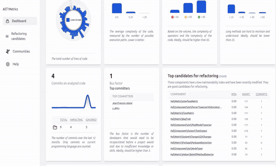

<p align="center" style="text-align:center">

</p>

<p align="center" style="text-align:center">
AST Metrics is a <b>multi-language static code analyzer</b>.  
<br />
It provides <b>architectural insights</b>, <b>complexity metrics</b>, and <b>activity analysis</b> - all in a <b>fast, standalone binary</b> ready for CI/CD.
</p>

<p align="center" style="text-align:center">
<a href="https://github.com/Halleck45/ast-metrics/actions/workflows/test.yml"></a>

<a href="https://opensource.org/licenses/MIT"></a>
<a href="https://github.com/sponsors/Halleck45"></a>

<a href="https://goreportcard.com/report/github.com/Halleck45/ast-metrics"></a>
<a href="https://codecov.io/gh/Halleck45/ast-metrics"></a></p>
</p>

<p align="center" style="text-align:center">
<a href="https://halleck45.github.io/ast-metrics/">Documentation</a> | <a href=".github/CONTRIBUTING.md">Contributing</a> | <a href="https://twitter.com/Halleck45">Twitter</a>
</p>

<br /><br/>

<table>
    <tr>
        <td width="50%" style="text-align:center">
            HTML Report
        </td>
        <td width="50%" style="text-align:center">
            CLI
        </td>
    </tr>
    <tr>
        <td width="50%" style="text-align:center">
            
        </td>
        <td width="50%" style="text-align:center">
            
        </td>
    </tr>
</table>


## Getting Started

Open your terminal and run the following command:

```console
curl -s https://raw.githubusercontent.com/Halleck45/ast-metrics/main/scripts/download.sh|bash
./ast-metrics analyze --report-html=<directory> /path/to/your/code
```

> To install it manually follow the detailed [installation instructions](https://halleck45.github.io/ast-metrics/getting-started/install/).


## Linting your code

Run:

```bash
ast-metrics init # create a .ast-metrics.yaml config file
ast-metrics lint
```

You can declare thresholds in your YAML config (*Lines of code per method, Coupling, Maintainability...*).

Example:

```yaml
requirements:
  rules:
    volume:
      loc: { max: 500 }
      lloc_by_method: { max: 30 }
    architecture:
      efferent_coupling: { max: 20 }
      maintainability: { min: 60 }
      coupling:
        forbidden:
          - from: Service
            to: Controller
```

This makes it **easy to enforce architecture and quality at scale**.

Run `ast-metrics ruleset list` to see the list of available rulesets. Then `ast-metrics ruleset add <ruleset-name>` to apply a ruleset to your project.

## Github Action

Create a `.github/workflows/ast-metrics.yml` file in your project with the following content:

```yaml
name: "AST Metrics"
on: [push]
jobs:
  build:
    runs-on: ubuntu-latest
    steps:
        - uses: halleck45/action-ast-metrics@v1
```

## Why AST Metrics?

- **Catch issues early**: detect complex or tightly coupled code.
- **Ensure architectural coherence**: validate dependencies and layering.
- **Understand your project at scale**: from cyclomatic complexity to bus factor.

## Features

+ **Architectural analysis**: community detection, coupling, instability.
+ **Linter**: enforce coding standards and best practices.
+ **CI/CD ready**: plug into GitHub Actions, GitLab CI, or any pipeline.
+ **Fast & dependency-free**: single binary, no setup required.
+ **Code metrics**: complexity, maintainability, size.
+ **Activity metrics**: commits, bus factor.
+ **Readable reports**: detailed HTML dashboards.

[Read more in the documentation](https://halleck45.github.io/ast-metrics/)

## Supported languages

+ ✅ **PHP** `<= PHP 8.4`
+ ✅ **Golang** `any version`
+ ✅ **Python** `Python 2, Python 3`
+ ✅ **Rust** `any version`
+ 🕛 **TypeScript**
+ 🕛 **Flutter**
+ 🕛 **Java**
+ 🕛 **C++**
+ 🕛 **Ruby**

## License

AST Metrics is open-source software [licensed under the MIT license](LICENSE)


## Contributing

AST Metrics is an actively evolving project.

We welcome discussions, bug reports, and pull requests.

➡️ Start [contributing here](.github/CONTRIBUTING.md)
