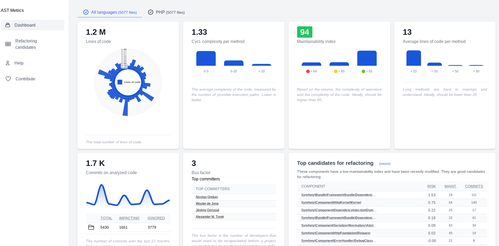

# AST Metrics [](https://github.com/Halleck45/ast-metrics/actions/workflows/test.yml) [](https://github.com/Halleck45/ast-metrics/actions/workflows/release.yml) [](https://github.com/Halleck45/ast-metrics/actions/workflows/github-code-scanning/codeql)


| Terminal application | HTML report |
| --- | ---------- |
|  | |

**AST Metrics is a blazing-fast static code analyzer that works across programming languages..** It empowers you to gain deep insights into your code structure, identify potential problems early on, and improve code quality.  Leveraging the efficiency of Go, AST Metrics delivers exceptional performance for large codebases.

[Twitter](https://twitter.com/Halleck45) | [Contributing](.github/CONTRIBUTING.md)

## Quick start

Open your terminal and run the following command:

```bash
ast-metrics analyze --report-html=<directory> /path/to/your/code
```

## Installation

AST Metrics is a standalone package. It does not require any other software to be installed.

**Follow the [installation instructions](https://halleck45.github.io/ast-metrics/getting-started/install/)**, or download directly the correct binary for your platform:

| Platform |  i386 | amd64 | arm64 |
| -------- |  ------ | ------ | ------ |
|  Linux    | [Download](https://github.com/Halleck45/ast-metrics/releases/download/v0.0.12-alpha/ast-metrics_Linux_i386) | [Download](https://github.com/Halleck45/ast-metrics/releases/download/v0.0.12-alpha/ast-metrics_Linux_x86_64) | [Download](https://github.com/Halleck45/ast-metrics/releases/download/v0.0.12-alpha/ast-metrics_Linux_arm64)
|  macOS    | - | [Download](https://github.com/Halleck45/ast-metrics/releases/download/v0.0.12-alpha/ast-metrics_Darwin_x86_64) | [Download](https://github.com/Halleck45/ast-metrics/releases/download/v0.0.12-alpha/ast-metrics_Darwin_arm64)
|  Windows  | [Download](https://github.com/Halleck45/ast-metrics/releases/download/v0.0.12-alpha/ast-metrics_Windows_i386.exe) | [Download](https://github.com/Halleck45/ast-metrics/releases/download/v0.0.12-alpha/ast-metrics_Windows_x86_64.exe) | [Download](https://github.com/Halleck45/ast-metrics/releases/download/v0.0.12-alpha/ast-metrics_Windows_arm64.exe)


## Contributing

AST Metrics is experimental and actively developed. We welcome contributions.

**Feel free to [open a discussion](https://github.com/Halleck45/ast-metrics/discussions)**. We love suggestions, ideas, bug reports, and other contributions. 

If you want to contribute code, please read the [contributing guidelines](.github/CONTRIBUTING.md) to get started.

We are looking for help to support new programming languages, stabilize the tool, and enrich it. Here is the list of supported languages:

+ ✅ **PHP** (full)
+ 👷 **Python** (partial)
+ 👷 **Golang** (partial)
+ 🕛 **Dart**
+ 🕛 **Flutter**
+ 🕛 **TypeScript**
+ 🕛 **Java**

## License

AST Metrics is open-source software [licensed under the MIT license](LICENSE)
