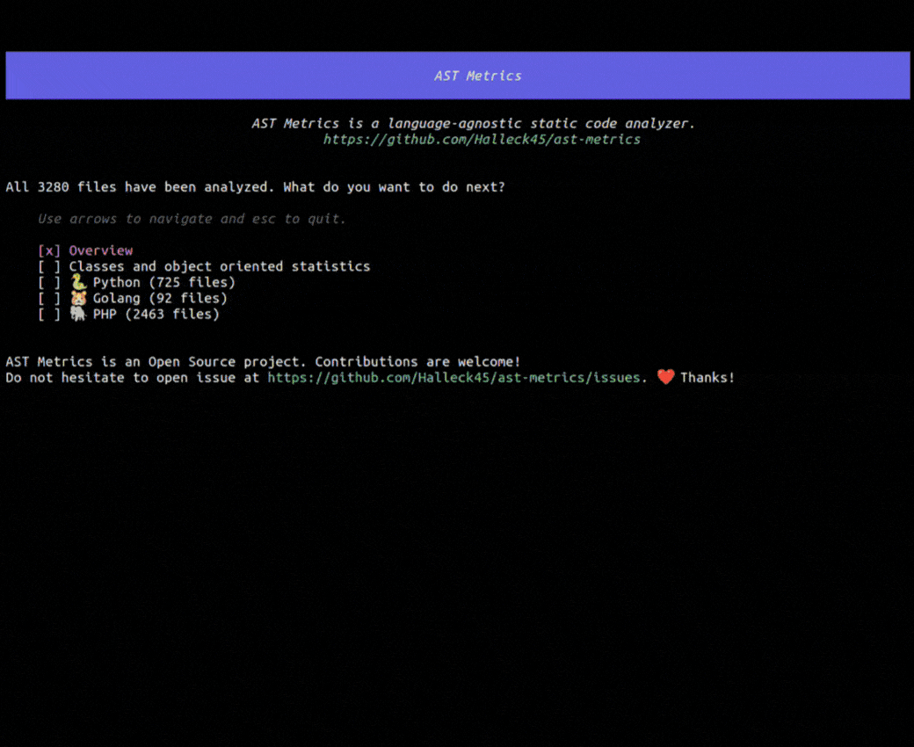

# AST Metrics

[](https://github.com/Halleck45/ast-metrics/actions/workflows/test.yml)

| Terminal application | HTML report |
| --- | ---------- |
|  | |

**AST Metrics is a language-agnostic static code analyzer.** It helps you to understand the structure of your code and to identify potential issues.

[Twitter](https://twitter.com/Halleck45) | [Contributing](.github/CONTRIBUTING.md)

## Usage

```bash
ast-metrics analyze <path>
```

Or generate HTML report:

```bash
ast-metrics analyze --report-html=<dir> <path>
```

You can also analyze more than one directory:

```bash
ast-metrics analyze <path1> <path2> <path3>
```
## Installation

AST Metrics is a standalone package. It does not require any other software to be installed.

| Platform |  i386 | amd64 | arm64 |
| -------- |  ------ | ------ | ------ |
|  Linux    | [Download](https://github.com/Halleck45/ast-metrics/releases/download/v0.0.9-alpha/ast-metrics_Linux_i386) | [Download](https://github.com/Halleck45/ast-metrics/releases/download/v0.0.9-alpha/ast-metrics_Linux_x86_64) | [Download](https://github.com/Halleck45/ast-metrics/releases/download/v0.0.9-alpha/ast-metrics_Linux_arm64)
|  macOS    | - | [Download](https://github.com/Halleck45/ast-metrics/releases/download/v0.0.9-alpha/ast-metrics_Darwin_arm64) | [Download](https://github.com/Halleck45/ast-metrics/releases/download/v0.0.9-alpha/ast-metrics_Darwin_x86_64)
|  Windows  | [Download](https://github.com/Halleck45/ast-metrics/releases/download/v0.0.9-alpha/ast-metrics_Windows_i386.exe) | [Download](https://github.com/Halleck45/ast-metrics/releases/download/v0.0.9-alpha/ast-metrics_Windows_x86_64.exe) | [Download](https://github.com/Halleck45/ast-metrics/releases/download/v0.0.9-alpha/ast-metrics_Windows_arm64.exe)

Or download the latest version of AST Metrics from the [releases page](https://github.com/Halleck45/ast-metrics/releases/latest).

> 💡 You don't know what is your platform? Run `uname -m` in your terminal.

## 🚀 Continuous integration

You can easily integrate AST Metrics into your CI/CD pipeline.

a [Github Action](https://github.com/marketplace/actions/ast-metrics-analysis) is available.

Create a `.github/workflows/ast-metrics.yml` file with the following content:

```yaml
name: AST Metrics
on: [push]
jobs:
  build:
    runs-on: ubuntu-latest
    steps:
        - name: AST Metrics
          uses: halleck45/action-ast-metrics@v1.0.2
```


## Supported languages

+ ✅ **PHP** (full)
+ 👷 **Python** (partial)
+ 👷 **Golang** (partial)
+ 🕛 **Dart**
+ 🕛 **Flutter**
+ 🕛 **TypeScript**
+ 🕛 **Java**


We are working on adding more languages. If you want to help, please see [CONTRIBUTING](.github/CONTRIBUTING.md).

## Options

File selection:

+ **Exclude** (`--exclude=<regex>`): Exclude files or directories from the analysis. You can use regular expressions.

Reports:

- **Markdown** (`--report-markdown=<filename>`): A report in markdown format.
- **HTML** (`--report-html=<dir>`): A report in HTML format.

Global options:

- **Verbose** (`--verbose`): Show debug information.
- **Interactive mode** (`--non-interactive`): Disable interactive mode.
- **Watch mode** (`--watch`): Watch files for changes and re-run the analysis.

## Contributing

AST Metrics is experimental and actively developed. We welcome contributions.

See [CONTRIBUTING](.github/CONTRIBUTING.md).

## License

See [LICENSE](LICENSE).
