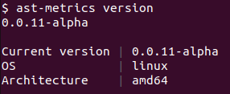

# Updating binaries

Updating AST Metrics is a simple process. You can update the binaries by running the following command in your terminal:

```bash
ast-metrics self-update
```

Now you should have the latest version. You can check the version by running:

```bash
ast-metrics version
```

Should display something like this:

