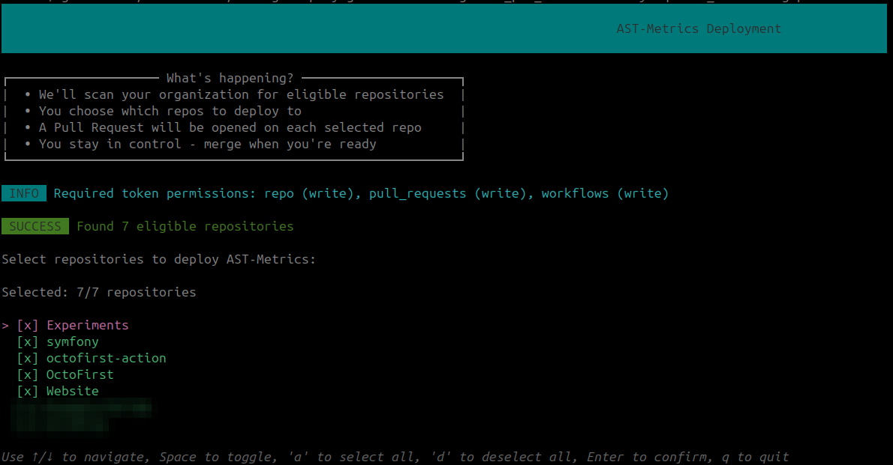

# Tips for your CI

## Generate all reports easily

The `ci` command is the one to call from a pipeline. It runs the linter first, then
generates every report (HTML, Markdown, JSON, OpenMetrics and SARIF):

```bash
ast-metrics ci .
```

If the linter finds violations, the command exits with a non-zero status but still
writes the reports, so you keep the artifacts of a failing build.

!!! warning "Renamed in v0.28.0"
    The former `analyze --ci` is deprecated and prints a warning. Use
    `ast-metrics ci` instead.

## Deploy to multiple repositories at once

If you manage multiple repositories in a GitHub organization, you can deploy AST Metrics to all (or some) of them with a single command. See the [Deploy to GitHub Organization](./deploy-github-org.md) guide for details.

```bash
ast-metrics deploy:github --token=<github-token> <organization-name>
```




## Comparing with another branch

You can compare the metrics of the current branch with another branch using the [`--compare-with`](../advanced-usage/compare-versions.md) flag.

```bash
ast-metrics ci --compare-with=main .
```

To gate a pull request on what the branch actually changed, prefer
[`ast-metrics review`](../getting-started/review-changes.md): it reports only new or
worsened findings, and ignores existing debt.
