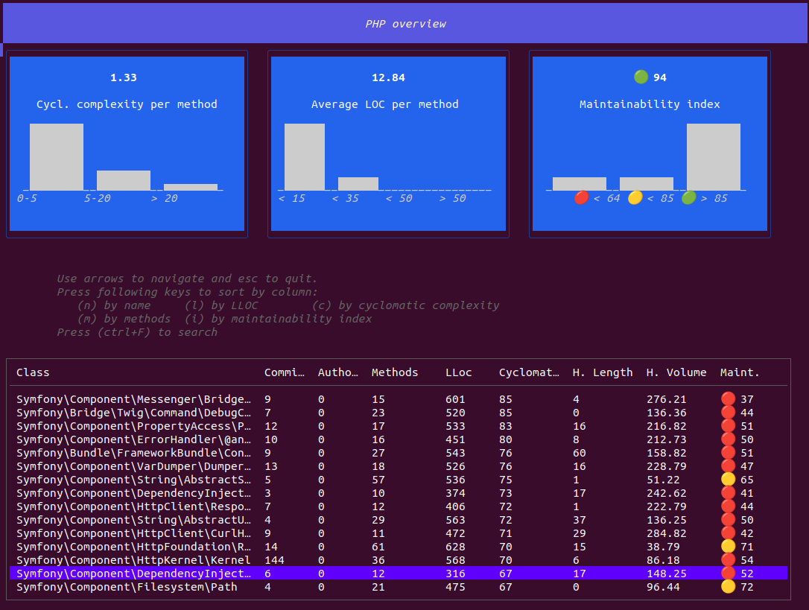

## Understanding the output

You don't understand anything about AST Metrics? No problem! 

This documentation will guide you through the basics of the tool, so you can start using it right away.

First of all, you need to understand that any source code can be represented as a tree. This tree is called an [Abstract Syntax Tree (AST)](https://en.wikipedia.org/wiki/Abstract_syntax_tree).

For example, this code:

```python
while b ≠ 0:
    if a > b:
        a := a - b
    else:
        b := b - a
return a
```

Can be represented as this tree:


<figure markdown="span">
  { align=center }
  <figcaption>The AST of the code, from Wikipedia</figcaption>
</figure>


**It is possible to perform calculations on this tree**, to determine the complexity of a function, the probability of an error... This is exactly what AST Metrics does.

Many metrics are integrated into AST Metrics, but here are the main ones.

## Risk

The Risk score is **the probability that the code needs refactoring**.

<figure markdown="span">
  { align=center width="300" }
</figure>

**This metric is based on the complexity of the code and its recent activity**. Indeed, a file committed often, with complex code, is probably a sign of risky code.

In the CLI application, open the `Top candidates for refactoring` section to see the files with the highest risk.


## Complexity

The complexity of a function is **an indicator of the difficulty to understand it**. The more complex a function is, the harder it is to maintain.

In general, a function should not exceed a score of 10. Beyond that, it is recommended to refactor it.

For a class, the complexity is the sum of the complexities of its methods.



In the screenshot above, the complexity of the `Symfony\Component\DependencyInjection\DependencyInjection` class is 67. 
This is a high complexity, but it is not necessarily a problem. It is important to analyze the context of the class to determine if it is necessary to refactor it.

## Maintainability

Maintainability is **an indicator of how easy it is to maintain the code**. It is a complex metric that takes into account the complexity, but also the richness of variables, operators...

This metric is very practical because it is extremely readable. It allows you to easily compare two files with each other.

**A good maintainability is a score above 85. Below 65, it is recommended to refactor the code** (if you are looking for maintainable code).

> Having maintainable code is not always a priority. Sometimes it is more important to have fast code, or code that consumes little memory.


In the screenshot above, the `MailerTransport` class has a maintainability score of 103. This is a very good score, which means that the code is easy to maintain.

You can also note that the global maintainability score is 94. This is a good score, frequent in Open Source projects.