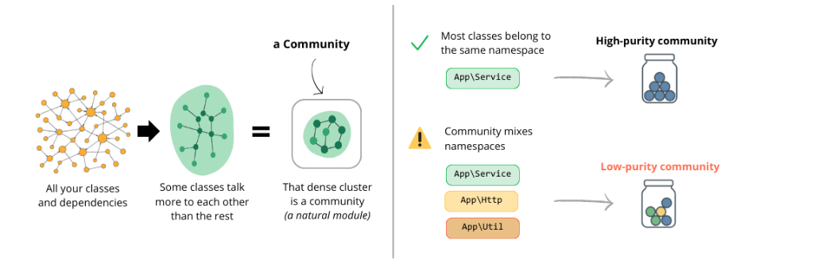

# Architecture Map

## What It Reveals

The Architecture Map shows you the **truth about your code structure**.

Developers often believe their architecture follows a certain pattern: "We have clean layers," "Our domain is isolated," "We follow hexagonal architecture." But code tells a different story.

**The Architecture Map doesn't lie.** It reveals:

- **The real dependencies**, not the intended ones
- **Hidden coupling** between modules you thought were independent
- **Circular dependencies** that make refactoring painful
- **Layer violations** where low-level code depends on high-level code

### What to Look For

**Vertical Strata**: If your application is well-layered, you'll see clear vertical levels. High-level components (controllers, UI) at the top, low-level utilities at the bottom.

**Flat Horizontal Graph**: Everything at the same level means your code lacks proper separation of concerns. No clear boundaries between layers.

**Cycles**: Circular dependencies appear as loops. These create rigid, hard-to-test code.

> [!TIP]
> If you think you have a layered architecture but the map shows a flat horizontal line, your code is not as decoupled as you think. The graph doesn't lie.

---

## How It Works

### 1. Community Detection

Instead of showing thousands of individual classes, AST Metrics groups them into **Communities** using the **Louvain Algorithm**.

A Community is a cluster of classes that interact more with each other than with the rest of the system.

### 2. Dependency Layering

Once communities are identified, the graph arranges them based on **Dependency Degree**:

-   **Top Layers**: High-level components (Controllers, Presentation). They depend on many things but are rarely depended upon.
-   **Bottom Layers**: Low-level components (Utilities, Core Domain, Infrastructure). Used by everyone but depend on few.

The vertical position is purely mathematical, based on how many dependencies point *to* vs *from* each component.
