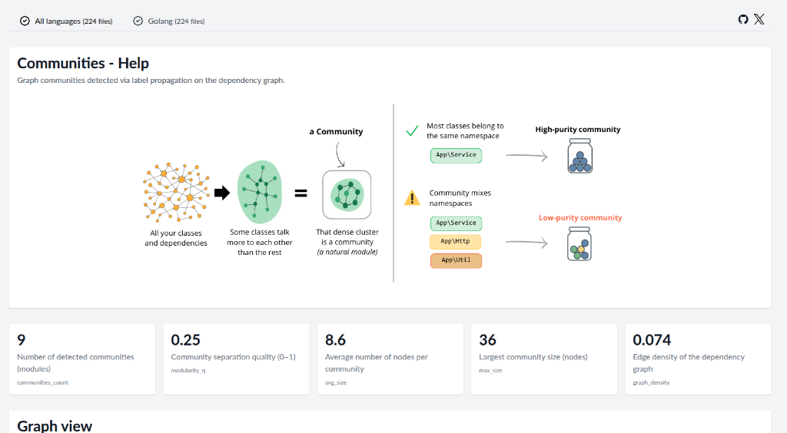

# Community Detection

## What is it?
Your code naturally forms "neighborhoods" or **communities**. Even if you didn't plan it, some classes talk to each other more than others.

AST Metrics uses the [**Louvain Algorithm**](https://en.wikipedia.org/wiki/Louvain_modularity) (a graph clustering algorithm) to detect these communities automatically based on the dependency graph.

## Why it matters?
- **Reality Check**: Does the code structure match your folder structure?
- **Leak Detection**: Are "Domain" classes talking to "Infrastructure" classes when they shouldn't?
- **Modularity**: Helps identify natural boundaries for microservices or modules.

## Interpreting the Results

### Purity
AST Metrics calculates the "purity" of a community by checking if its members belong to the same namespace.

- **High Purity**: The community corresponds to a namespace. Good modularity.
- **Low Purity**: The community is a mix of unrelated namespaces. This often indicates **Spaghetti Architecture** or hidden dependencies.

### Modularity Score
A global score (0-1) indicating how well the network divides into modular communities. High modularity means dense connections within modules and sparse connections between them.
