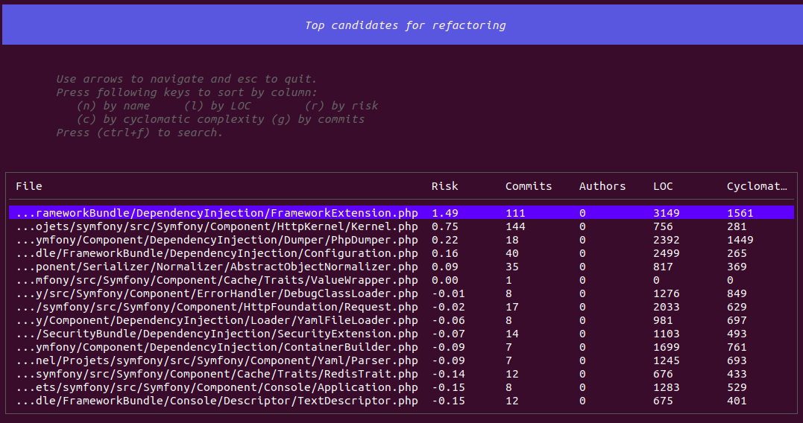

# Risk Score

## What is it?
The Risk score is **the probability that the code needs refactoring**.

It is a composite metric that identifies "Hotspots" in your codebase.

## How is it calculated?
The Risk score is calculated based on two main factors:
1.  **Complexity**: How hard is the code to understand? (Cyclomatic Complexity)
2.  **Activity**: How often is this code changed? (Git Churn)

$$ Risk = Complexity \times Churn $$

## Why it matters?
- **Complex code that never changes** is not a high risk. It works, leave it alone.
- **Simple code that changes often** is fine.
- **Complex code that changes often** is a **Time Bomb**. This is where bugs are most likely to be introduced.

## How to use it?
In the CLI application, look at the `Top candidates for refactoring` section. These are the files with the highest Risk score.

!!! tip "Prioritize Refactoring"

    Don't just refactor everything. Focus your energy on the High Risk files first. These will give you the best Return on Investment (ROI).
